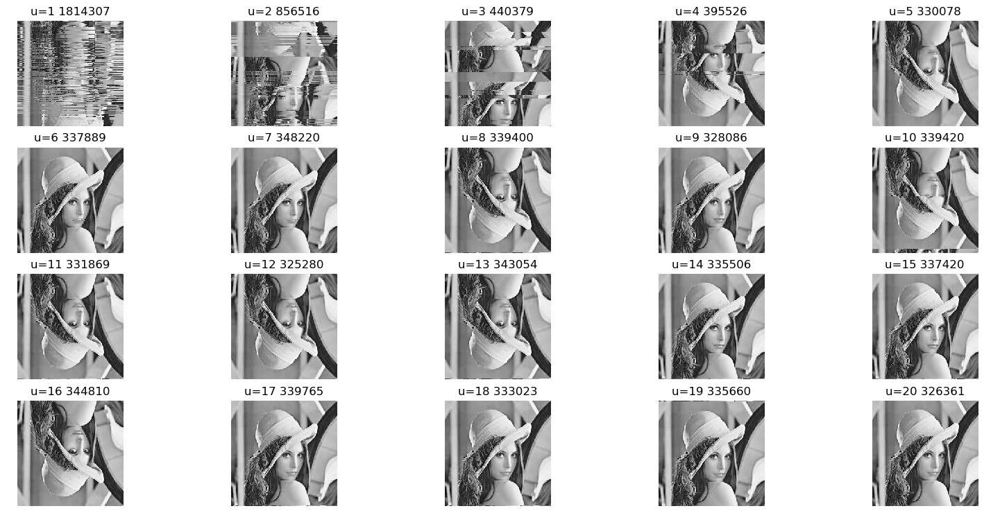
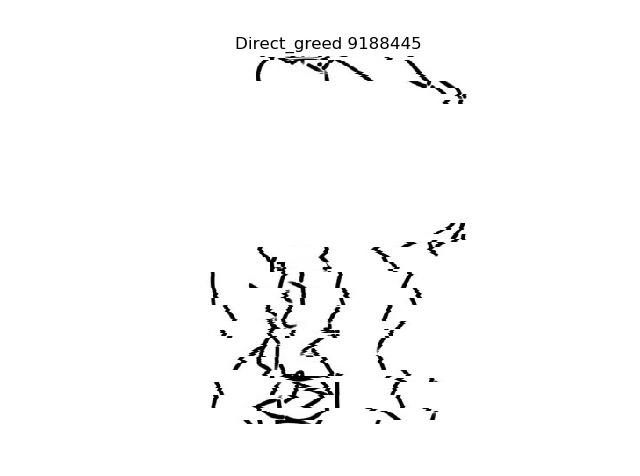

<center><font size=6><b>图片恢复算法</b></font></center>
<center><font size=2>编写于2019年4月12日 </font></center>
<div align='right'><b><font face="楷体"size=4>曲岳 </font><i>QuYue</i></b></div>

---
<font size=5><b>&emsp;目录</b></font>
[TOC]
---
## 1 问题介绍
&emsp;&emsp;如果我们将图片进行**随机的打乱**（当然是只对行或者对列进行打乱），这样图片对于人来说已经是不可以识别出来的了，如图1所示。那么我们是否可以对其进行恢复呢？而这就是本文将准备挑战的问题。

<center>

<br>图1. 图片恢复挑战</br>
</center>

## 2 算法介绍
&emsp;&emsp;这里使用了**3种算法**来分别对图片进行恢复，为了方便我们这里先只考虑对**灰度图**的行(row)进行打乱这个问题（因为只有一个通道，而RGB有三个通道），即图2的任务。
<center>

<br>图2. 灰度图恢复</br>
</center>

&emsp;&emsp;在这里的图的题目中有一个值，这个是我用来衡量图片的流畅度的值$score$，其是每一行元素值的差分的绝对值，如果一个$m*n$的图片$M$,那么其流畅度$score(M)$如公式1所示：
```math
 score(M)=\sum_{i=1}^{m-1}{\sum_{j=1}^{n}|(M_{i,j}-M_{i+1,j})|}
```
其中$M_{i,*}$是图片$M$的第一行向量。这个值可以一定程度上衡量图片行与行之间的流畅度，而从图2可以发现打乱后$score$的值会变得很大。

### 2.1 SVD分解排序
#### 2.1.1 原理介绍
&emsp;&emsp;奇异值分解（SVD）是一个比较好的矩阵分解方法，被广泛的用于降维等机器学习任务中。其基本公式可见公式2：
```math
 M=U \Sigma V^* \tag{2}
```
其中
- $M\in\Reals^{m \times n}$
- $U\in\Reals^{m \times m}$，$U$是一个酉矩阵，其每一列组成一套对$M$的正交"输入"或"分析"的基向量。这些向量是$MM^*$的特征向量。
- $V\in\Reals^{n \times n}$，$V$也是一个酉矩阵，其每一列代表了对$M$的正交"输入"或"分析"的基向量。这些向量是$M^*M$特征向量，$V^*$是$V$的共轭转置。
- $\Sigma\in\Reals^{m \times n}$，$\Sigma$则是一个半正定的对角阵。其对角线上的元素是奇异值，可视为是在输入与输出间进行的标量的"膨胀控制"，这些是$M^*M$及$MM^*$的奇异值，并与$U$和$V$的列向量相对应。

&emsp;&emsp;$U$的每一列会对应不同大小的奇异值，而$\Sigma$的奇异值通常都是从大到小进行排列的，奇异值越大，对应的信息也越重要，相应的奇异值越小，对应的信息也越不重要，甚至有可能是噪声（这也是去噪以及降维的原理）。
&emsp;&emsp;而[刘传仁](https://www.lebow.drexel.edu/people/chuanrenliu "刘传仁主页")老师提出了以下的三个假设：
1. 因为在计算的时候$U$第一列的每个元素会与$\Sigma$的第一个对角元素（即第一个奇异值）相乘，而该元素恰好又是最重要的元素（是最大的奇异值），所以相应的我们可以认为$U$的第一列也是最重要的。
2. 对于一张正常的图片来说，通常每一行之间相差的都不大。
3. 基于以上两个假设，我们可以对一个被打乱的图片计算$U$值，然后使用其第一列的数，进行从大到小排序，这样图片的相邻行的内容相差会很小，图片会在一定程度上进行恢复。

&emsp;&emsp;其**过程如算法1**所示：


#### 2.1.2 结果展示与评价
&emsp;&emsp;其**结果如图3**所示：
<center>

<br>图3. lena SVD分解排序</br>
</center>

&emsp;&emsp;我们可以看出，图片相关的部分在一定程度上都成片的聚集在一起，其$score$确实下降了，但总体效果并不是很理想，与原图还有一定的差距。所以可以看出**SVD分解排序算法的缺点是只考虑了最大的奇异值对应的信息**，这样是不够的。
### 2.2 SVD分解贪心法
#### 2.2.1 原理介绍
&emsp;&emsp;即然一个奇异值提供的恢复信息不够，那么为何不多取几个奇异值呢？所以算法SVD分解贪心法就基于这个思想。
&emsp;&emsp;首先让我们看一下图片打乱前后的$U$的前几列的值的分布，如图4所示：
<center>

<br>图4. 打乱前后的U的前4列</br>
</center>

&emsp;&emsp;可见打乱前$U$的前几列每一行过渡的都很均匀，并没有忽然的突变，而打乱后$U$的前几列变化的很剧烈，不均匀`（通过颜色的变化就可以看出）`。所以我们只要想办法将突变比较剧烈的$U$的前几列经过重排列后，使其变化平缓一点就好了。`注意：也不能取太多的列，经过我观察，原始图片的U矩阵的列越到后面排列的越不平缓，如果使用的这些列的话会对图片的恢复有着明显的影响。`
&emsp;&emsp;所以该算法通过选取多个奇异值对应的信息，即$U$的前几个列的值，然后通过贪心法将$U$不同的行通过计算前几个奇异值最接近的方式拼接到一起，得到一个新的图片，这样就可以进行图片恢复了。
&emsp;&emsp;其具体**过程如算法2**所示：

其中贪心算法$GREED$如**如算法3**所示：

#### 2.2.2 结果展示与评价
&emsp;&emsp;其**结果如图5**所示：
<center>

<br>图5. lena SVD分解贪心法</br>
</center>

&emsp;&emsp;其中$u$值是选取的矩阵$U$的前$u$列，可见SVD分解贪心法的效果还是很好的，**当$u$值增大，恢复的效果随之提升，但是也不能让$u$值增的过大**，因为如我上面所说，后面的值分布并不平缓，对于这些权重较小的列我们就不要考虑了（如果非要考虑的话也许在计算距离的时候需要对不同列使用不同的权重），当$u=12$时可以让$score$(**325280**)十分接近原图（**325187**）。

### 2.3 直接贪心法
#### 2.3.1 原理介绍
&emsp;&emsp;其实根据SVD分解贪心法，我们也可以思考，也许我们可以不使用SVD的$U$矩阵来计算距离使用贪心法，图片本身的像素也是一个很好的特征，通常图片相邻行的像素之间的过渡也较为平稳。
&emsp;&emsp;所以直接将图片的每一行作为特征，直接输入到**算法3**中，这就是直接贪心法。
&emsp;&emsp;其具体**过程如算法4**所示：

#### 2.3.2 结果展示与评价
&emsp;&emsp;其**结果如图6**所示：
<center>

<br>图6. lena 直接贪心法</br>
</center>

&emsp;&emsp;可以看出直接贪心法的效果也不错，虽然没有参数可调，但是性能稳定，能较快的找到一个较好的解，恢复后的图片$score$(**325280**)十分接近原图（**325187**），也和SVD分解贪心法的$u=12$的$score$一模一样。

### 2.4 其它
&emsp;&emsp;那么接下来我们就要重新的看一下最开始的任务，就是分类彩图（对于列打乱就不细说了，先把图片转置一下就行了），我们可以将图片的RGB三个通道横着铺在一起，变成一张单通道就可以了。我们可以看一下效果，**如图7, 8, 9，10**：
<center>

<br>图7. 图片恢复</br>
</center>
<center>

<br>图8. lena SVD分解排序</br>
</center>
<center>

<br>图9. lena SVD分解贪心法</br>
</center>
<center>

<br>图10. lena 直接贪心法</br>
</center>
&emsp;&emsp;发现了一个有意思的问题，就是对于SVD分解贪心法，$score$（**14319923**）甚至可以比原图还低（**15906216**）
，也许是我的评价指标并不好......

### 3 结果展示
&emsp;&emsp;下面就是一些结果的展示，选取了许多不同的图片，有些比较有趣的结果。
#### 3.1 book
<center>

<br>图11. book图片恢复</br>
</center>
<center>

<br>图12. book SVD分解排序</br>
</center>
<center>

<br>图13. book SVD分解贪心法</br>
</center>
<center>

<br>图14. book 直接贪心法</br>
</center>

&emsp;&emsp;我发现对于内容色彩较丰满的图片，基本上都能恢复的很好。那么下面挑战一些难的吧。

#### 3.2 win10
<center>

<br>图15. win10图片恢复</br>
</center>
<center>

<br>图16. win10 SVD分解排序</br>
</center>
<center>

<br>图17. win10 SVD分解贪心法</br>
</center>
<center>

<br>图18. win10 直接贪心法</br>
</center>

&emsp;&emsp;win10图片的对称性很好，这是这张图的问题，而且中间的部分总是恢复的有问题，算法认为把上下两个窗放在一起会更好。同时见**图17**可以发现，SVD分解贪心算法的$score$最小的$u=8$却比较大的$u=6$效果要差，看来$score$并不适合所有图片。

#### 3.3 Baidu
<center>

<br>图19. Baidu图片恢复</br>
</center>
<center>

<br>图20. Baidu SVD分解排序</br>
</center>
<center>

<br>图21. Baidu SVD分解贪心法</br>
</center>
<center>

<br>图22. Baidu 直接贪心法</br>
</center>

&emsp;&emsp;Baidu的效果很差，可能是因为白色的地方真的完全是白的，这些白色的行对结果干扰很大，会让中间商标的位置随便上下移动（例如**图21**的$u=12$）。

#### 3.3 sketch简笔画
<center>

<br>图23. sketch图片恢复</br>
</center>
<center>

<br>图24. sketch SVD分解排序</br>
</center>
<center>

<br>图25. sketch SVD分解贪心法</br>
</center>
<center>

<br>图26. sketch 直接贪心法</br>
</center>

&emsp;&emsp;简笔画算是特别难的课题了，但没想到SVD分解贪心法效果还不错，远远超过了直接贪心法，这也许可以证明SVD分解贪心法对较难的课题效果比直接贪心法要好。

#### 3.4 QR_code二维码
<center>

<br>图27. QR_code图片恢复</br>
</center>
<center>

<br>图28. QR_code SVD分解排序</br>
</center>
<center>

<br>图29. QR_code SVD分解贪心法</br>
</center>
<center>

<br>图30. QR_code 直接贪心法</br>
</center>

&emsp;&emsp;二维码也许是最难的挑战了，所有的算法效果都不好，因为二维码跟本就不满足之前图片每一行之间的变化缓慢的假设，**见图29**，可以隐约看出那个识别点能看出了，而**图30**就完全失效了。

#### 3.5 未来的扩展
&emsp;&emsp;这里说一下未来本算法的扩展，我觉得可以分成以下3个方面。
1. 多图：我们可以设计对多个图进行打乱，同时进行恢复，这样会让总体效果更好。
2. 图像加密：也许我们可以向图像加密进军，但问题是这些算法有可能无法完全恢复图片，所以也许加密的时候需要加一个标准图片（比较好恢复的图片），让其余需要被加密的图片都和这个标准图片被相同的顺序打乱，这样就可以较好的恢复回去了。
3. 时间序列与CNN：我们可以对矩阵形式的数据（例如时间序列）进行排序，对于时间序列来说，时间维度是不可以动的，但是特征的维度大家一般都没有考虑过，我们可以认为其特征的维度是被打乱过顺序的，我们可以将其恢复成有形状的样子，这样时间序列就可以被CNN进行滤波了（计算机视觉的发展还是属于比较好的领域），这样将不同的领域进行了结合。

# 4 代码
&emsp;&emsp;


---
*To my family,with love*    
*To my friend,with encourage*   
*To my teacher,with gratitude*
